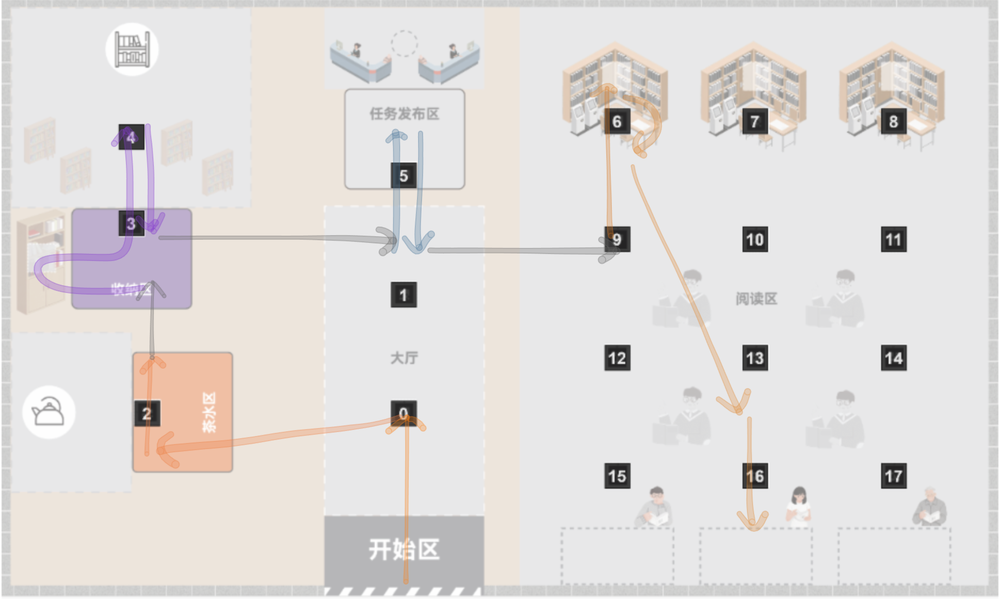
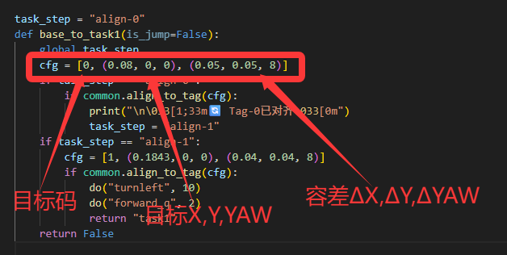
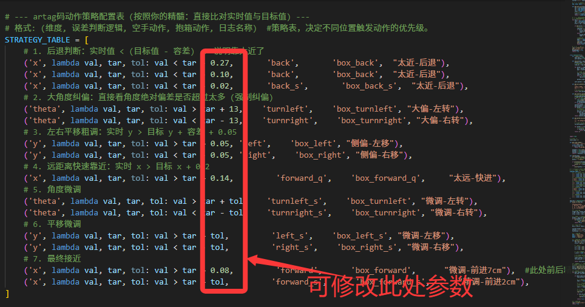
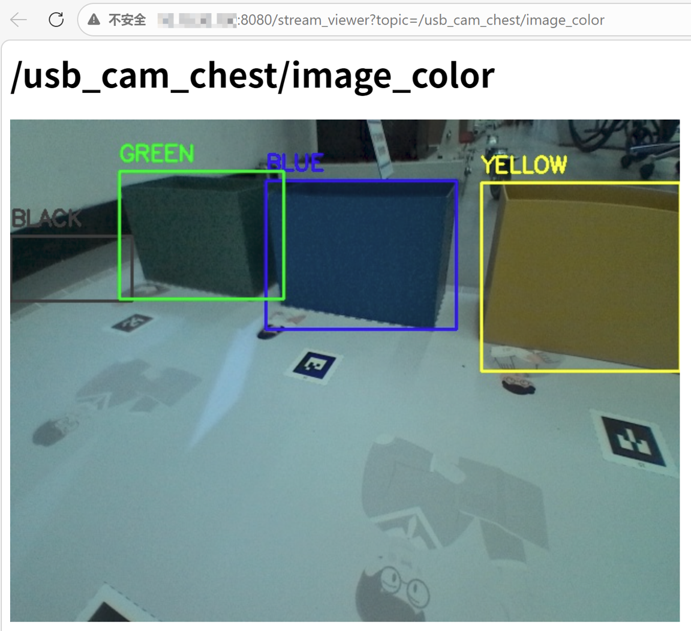
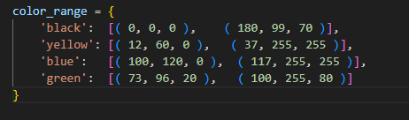
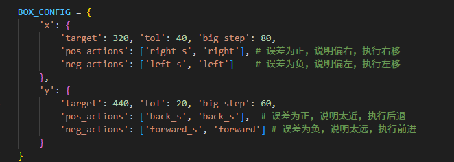
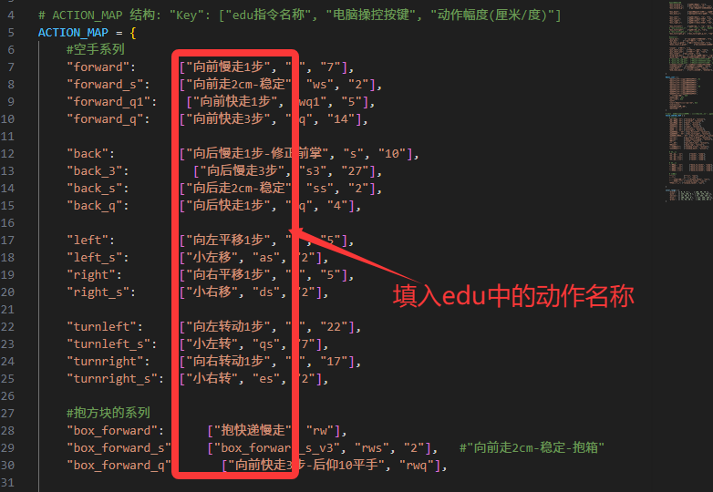
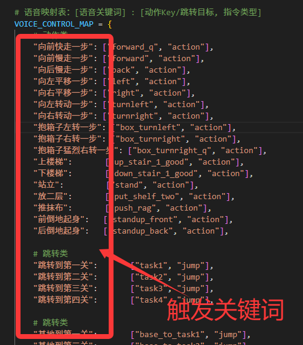
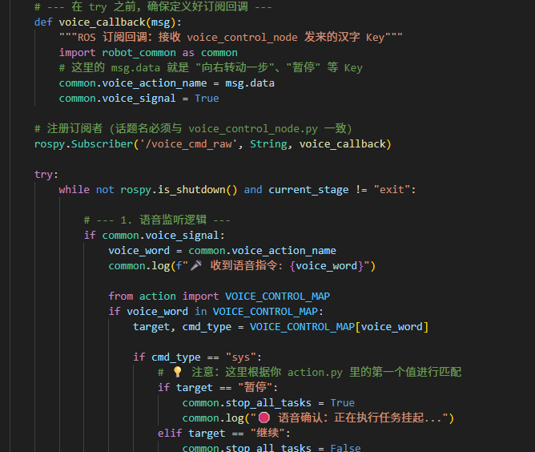

# 2026比赛程序说明文档

本文件夹包含了 Aelos 机器人比赛运行全套核心代码，指导选手从运行代码、到微调代码、到改进代码。


# 一、程序结构介绍


### 代码结构
```
test/
├── src/                     # 主要代码目录
│   ├── robot_logic.py        # 逻辑文件（主程序入口，最重要）
│   ├── robot_common.py       # 公共文件（重要）
│   └── action.py            # 动作和其它文件
│   ├── debug_action.py                # 动作测试脚本
│   ├── debug_artag.py            # Tag码测试脚本
│   └── debug_color.py             # 颜色识别测试脚本
├── debug/                    # 各种颜色调试工具
│   ├── captured/                # 拍摄图片存储路径
│   ├── camera_shoot.py            # 拍摄脚本
│   └── hsvSelectTools.py             # 取色工具
├── ASR/                      # 语音本地识别模型
│   └── sherpa-onnx-streaming-zipformer-zh-int8-2025-06-30   # ASR模型文件（占用较大）
├── images/                     # readme文档图片
└── README.md                  # 项目说明文档
```

### 最重要文件是以下三个：
#### 🔧 `robot_common.py` (通用工具)
* 包含如何趋近Tag码、如何识别方块、如何趋近方块、如何走向颜色大盒子、文字识别OCR等的逻辑

#### 🧠 `robot_logic.py` (具体逻辑)
* 定义了具体的各个任务之间的跳转逻辑

#### 🔊 `robot_voice.py` (语音控制)
* 实现发布语音话题，其能够控制robot_logic.py中的逻辑


# 二、运行程序

## 准备工作

### edu中下载全部动作函数

导入edu工程文件，连接串口，下载全部动作函数，断开串口

<font color='red'> **注：执行python程序时必须将edu串口断开，否则动作无法执行** </font>

### 启动主程序
vscode ssh连接机器人后，将程序文件夹拷贝到机器人任意目录下，并切换到此目录
```
# 在终端输入

cd ~/jushen_code_CRAIC/test/src

python robot_logic.py
```

### 安装必要库

运行前需先安装必要库
```
pip3 install rapidocr_onnxruntime onnxruntime   #安装 RapidOCR 及其 ONNX 运行时
```
若还有其它缺少库报错，请自行尝试解决。


### 观察机器人运行

正常情况下，机器人会按照以下路径完成所有任务



### 启动语音控制

```
# 同时，再打开第二个终端输入

cd ~/jushen_code_CRAIC/test/src

python robot_voice.py
```
然后使用麦克风对准说话，即可通过ROS话题，将指令发送至主逻辑

**注意：语音加载需要时间较长**


# 三、Tag码调试方式


### 调试图像

```
电脑网页地址输入：http://机器人IP:8080/stream_viewer?topic=/usb_cam_chest/image_raw
```
* 使用场景：观察机器人视角，了解摄像头的Tag码识别范围界限（太远或太近都无法识别）。

### 调试Tag码
```
python debug_artag.py
```
* 使用场景：当机器人看不到码时，可以用这个脚本测试。
* 操作流程：将Tag码放到机器人面前，将会输出观察到的所有码的坐标信息。移动机器人，观察X、Y、YAW参数变化，了解各个参数含义，


### 更改Tag码位置参数

在`robot_logic.py`中，可以更改对齐码的位置，即修改cfg配置：

* 目标码：要识别的码号
* 目标X、Y、YAW：Tag码相对摄像头的距离、水平偏移、角度偏移。单位为m、m、°。
* 容差（tol）ΔX、ΔY、ΔYAW：允许的误差，容差越大，定位精度越低，越快完成定位；容差越小，定位精度越高，但可能出现左右反复微调的情况。**一般来讲，容差不应太小，否则容易反复来回走，建议ΔX和ΔY设置为0.02以上，ΔYAW设置为3以上**

### 更改Tag码对齐策略

在`robot_common.py`中，tag码对齐策略表决定了看到码怎么动（如先左右移还是前后移）、动多少（如选择大步还是小步）。

**此配置表对于定位的快、准至关重要。**





# 四、颜色调试方式


### 测试识别颜色
```
python debug_color.py
```


* 使用场景：当机器人走向错误的颜色方向，可以用这个脚本测试。
* 操作流程：观察网页端颜色识别到的目标。当机器人误识别目标时，可以用它看是识别到了什么错误目标。


### 更改颜色参数

场地光线不同，会影响识别颜色，需要根据场地修改。



此处的HSV色值获取方式如下：
```
cd debug
python camera_shoot.py    # 拍摄图像并存储
python hsvSelectTools.py -i ./captured/captured_example.jpg  # 替换为你拍摄的图片路径
```
注：运行hsvSelectTools.py时，若vscode没有设置X11转发，则建议在VNC或者MobaXTerm或机器人连接显示器操作，否则无法看到画面。


### 抱黑色方块位置参数

在`robot_common.py`中找到`BOX_CONFIG`，在这可以修改抱起黑色方块的对准坐标



# 五、动作调试方式

### 测试动作
```
python debug_action.py
```
* 使用场景：当机器人某个动作无法执行时，可以用这个脚本测试。
* 操作流程：终端输入遥控指令，控制机器人动作，以验证所有动作是否正常。具体键位参照src/action.py的ACTION_MAP表。


### 更换动作

不同的机器人的状态，会影响动作执行的精准度，若给定动作无法执行（尤其是推抹布、上楼梯、下楼梯），则需自行更换动作。

对推抹布、上楼梯、下楼梯这类精准执行的动作，同样的动作src会因为不同机器，表现有所差异，可自行在edu中编辑修改动作，并重新下载全部动作函数。

更换新动作后，需要在`action.py`中进行名称替换，如图所示列。




# 六、程序逻辑调试方式

本示例采用状态机实现任务跳转，可在终端看到详尽的状态输出。

### 修改启动关卡

在robot_logic.py中修改：
```
current_stage = "task4"  #替换为你想开始的关卡
```
可以从某一关开始测试，这样就不需要从头开始测试

### 模拟模式

模拟模式下，机器人只识别，不执行动作，可用于快速验证算法逻辑。开启方式是：将`robot_logic.py`中的```common.SIMULATE_MODE = False```改为```True```


# 七、语音控制

`robot_voice.py`语音运行和`robot_logic.py`逻辑运行可以分别单独运行，当两个同时运行的时候，语音运行将会影响实际逻辑运行。

**语音控制包括三类**：
* action：执行单个动作
* jump：执行跳转任务
* sys：暂停、继续等指令

注：若机器人处在固定动作逻辑程序中，将无法响应语音动作。但选手可自行修改优化，此处仅为示例。

### 调试语音
```
python robot_voice.py
```
对照action.py中的语音映射表VOICE_CONTROL_MAP，说出关键词，看是否能够命中指令。


### 语音修改方式

`action.py`中定义了触发关键词和对应指令，可自行添加和修改



`robot_voice.py`中定义了对语音关键词的识别逻辑，决定语音识别准不准

`robot_logic.py`中定义了对接收到语音信号的处理逻辑，决定语音如何控制机器人。在 这里可以更改对接收到的语音控制命令的处理逻辑。



# 八、完善方向建议

1. 设计更短的移动路径
2. 设计更快的动作
3. 设计更准的识别算法
4. 设计更灵活的语音控制